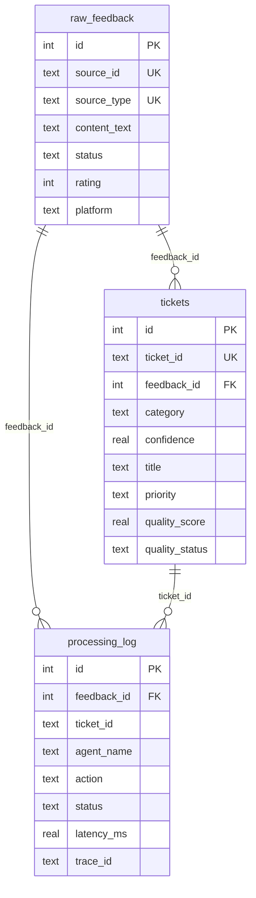

# Database Schema

## Overview

The system uses **SQLite** with WAL (Write-Ahead Logging) journal mode for concurrent read/write support. The database consists of 3 tables: `raw_feedback` for ingested feedback, `tickets` for generated tickets, and `processing_log` for audit trails.

All schema definitions are in `src/db/database.py`. Query helpers are in `src/db/queries.py`.

## Connection Management

### `get_db_path()` (`database.py:74`)

Returns the database path from `settings.db_path` (default: `data/db/feedback.db`).

### `get_conn(db_path=None)` (`database.py:78-85`)

Creates a SQLite connection with:
- **Row factory** enabled (`sqlite3.Row`) — query results are accessible by column name
- **WAL journal mode** (`PRAGMA journal_mode=WAL`) — allows concurrent reads during writes
- **Foreign keys** enabled (`PRAGMA foreign_keys=ON`) — enforces referential integrity

### `init_db(db_path=None)` (`database.py:88-99`)

Creates the parent directory (if needed) and all 3 tables using `CREATE TABLE IF NOT EXISTS`. This is idempotent — safe to call multiple times. Called automatically on Streamlit startup (`app.py:24-27`).

---

## Table: `raw_feedback`

Stores all ingested user feedback. Defined at `database.py:8-27`.

| Column | Type | Constraints | Description |
|--------|------|-------------|-------------|
| `id` | INTEGER | PRIMARY KEY AUTOINCREMENT | Internal auto-incrementing ID |
| `source_id` | TEXT | NOT NULL | External ID from source (e.g., `review_id`, `email_id`, `MANUAL-abc123`) |
| `source_type` | TEXT | NOT NULL | `app_store_review` \| `support_email` \| `manual_input` |
| `source_file` | TEXT | | Filename of the uploaded CSV |
| `content_text` | TEXT | NOT NULL | The feedback text body |
| `subject` | TEXT | | Email subject line (support emails only) |
| `sender` | TEXT | | User name or email address |
| `rating` | INTEGER | | Star rating 1-5 (app store reviews) |
| `platform` | TEXT | | e.g., `Google Play`, `App Store` |
| `priority_hint` | TEXT | | Priority from email (support emails only) |
| `original_date` | TEXT | | Original feedback timestamp |
| `app_version` | TEXT | | App version at time of feedback |
| `raw_json` | TEXT | | Full original row serialized as JSON |
| `status` | TEXT | NOT NULL DEFAULT `'pending'` | Processing status |
| `created_at` | TEXT | NOT NULL DEFAULT `datetime('now')` | Row creation timestamp |
| `updated_at` | TEXT | NOT NULL DEFAULT `datetime('now')` | Last update timestamp |

**Constraints:**
- `UNIQUE(source_id, source_type)` (`database.py:26`) — prevents duplicate ingestion of the same feedback item

**Status lifecycle:**
```
pending → classified → analyzed → ticketed → reviewed
```
Each agent updates the status via `update_feedback_status()`.

---

## Table: `tickets`

Stores generated tickets linked to their source feedback. Defined at `database.py:30-53`.

| Column | Type | Constraints | Description |
|--------|------|-------------|-------------|
| `id` | INTEGER | PRIMARY KEY AUTOINCREMENT | Internal ID |
| `ticket_id` | TEXT | NOT NULL UNIQUE | Human-readable ID: `TKT-YYYYMMDD-NNN` |
| `feedback_id` | INTEGER | NOT NULL, FK → `raw_feedback.id` | Link to source feedback |
| `category` | TEXT | NOT NULL | `Bug` \| `Feature Request` \| `Praise` \| `Complaint` \| `Spam` |
| `confidence` | REAL | NOT NULL | Classification confidence 0.0-1.0 |
| `title` | TEXT | NOT NULL | Ticket title |
| `description` | TEXT | NOT NULL | Full ticket description |
| `priority` | TEXT | NOT NULL | `Critical` \| `High` \| `Medium` \| `Low` |
| `severity` | TEXT | | Bug severity: `Critical` \| `Major` \| `Minor` \| `Cosmetic` |
| `technical_details` | TEXT | | JSON string of `BugAnalysis` output |
| `feature_details` | TEXT | | JSON string of `FeatureAnalysis` output |
| `suggested_actions` | TEXT | | JSON array string of recommended actions |
| `quality_score` | REAL | | Quality Critic score 0.0-10.0 |
| `quality_notes` | TEXT | | Quality Critic review notes |
| `quality_status` | TEXT | DEFAULT `'pending'` | `pending` \| `approved` \| `revision_needed` |
| `revision_count` | INTEGER | DEFAULT `0` | Number of revision attempts |
| `manually_edited` | INTEGER | DEFAULT `0` | Boolean flag (0/1) for manual edits |
| `edited_by` | TEXT | | Who edited (e.g., `streamlit_user`) |
| `created_at` | TEXT | NOT NULL DEFAULT `datetime('now')` | Creation timestamp |
| `updated_at` | TEXT | NOT NULL DEFAULT `datetime('now')` | Last update timestamp |

**Constraints:**
- `FOREIGN KEY (feedback_id) REFERENCES raw_feedback(id)` (`database.py:52`)
- `ticket_id` is `UNIQUE` (`database.py:33`)

**Ticket ID format:** `TKT-YYYYMMDD-NNN` — date-based with a zero-padded daily counter (e.g., `TKT-20260323-001`, `TKT-20260323-002`). Generated by `generate_ticket_id()` (`queries.py:119-135`).

---

## Table: `processing_log`

Audit trail of every agent action. Defined at `database.py:56-70`.

| Column | Type | Constraints | Description |
|--------|------|-------------|-------------|
| `id` | INTEGER | PRIMARY KEY AUTOINCREMENT | Internal ID |
| `feedback_id` | INTEGER | | FK to `raw_feedback.id` (optional) |
| `ticket_id` | TEXT | | Associated ticket ID (optional) |
| `agent_name` | TEXT | NOT NULL | `csv_agent` \| `classifier` \| `bug_analyzer` \| `feature_extractor` \| `ticket_creator` \| `quality_critic` |
| `action` | TEXT | NOT NULL | `ingest` \| `classify` \| `analyze` \| `extract` \| `create_ticket` \| `review` |
| `status` | TEXT | NOT NULL | `success` \| `error` |
| `input_summary` | TEXT | | Brief input description (e.g., `text_length=150`) |
| `output_summary` | TEXT | | Brief output description (e.g., `category=Bug, confidence=0.92`) |
| `error_message` | TEXT | | Error details if `status=error` |
| `latency_ms` | REAL | | Processing time in milliseconds |
| `trace_id` | TEXT | | Langfuse trace ID for correlation |
| `created_at` | TEXT | NOT NULL DEFAULT `datetime('now')` | Timestamp |

---

## Entity Relationships



---

## Query Helpers Reference

All functions are in `src/db/queries.py`. Every function accepts an optional `conn` parameter — if `None`, a new connection is created and closed automatically.

### raw_feedback Queries

#### `insert_feedback()` (`queries.py:15-58`)

```python
def insert_feedback(
    source_id: str,
    source_type: str,
    content_text: str,
    *,
    source_file: str | None = None,
    subject: str | None = None,
    sender: str | None = None,
    rating: int | None = None,
    platform: str | None = None,
    priority_hint: str | None = None,
    original_date: str | None = None,
    app_version: str | None = None,
    raw_json: str | None = None,
    conn: sqlite3.Connection | None = None,
) -> int
```

Inserts a feedback row. Uses `INSERT OR IGNORE` to handle the `UNIQUE(source_id, source_type)` constraint — if a duplicate exists, it fetches and returns the existing `id` (`queries.py:49-54`). Returns the `feedback_id`.

**Example:**
```python
fid = insert_feedback("REV-001", "app_store_review", "App crashes on login", rating=1)
```

#### `update_feedback_status()` (`queries.py:61-76`)

```python
def update_feedback_status(feedback_id: int, status: str, conn=None) -> None
```

Updates the `status` and `updated_at` fields. Called by every agent after processing.

#### `get_feedback_by_id()` (`queries.py:79-91`)

```python
def get_feedback_by_id(feedback_id: int, conn=None) -> Optional[dict]
```

Returns a single feedback record as a dict, or `None` if not found. Used by the Dashboard to show original feedback alongside tickets.

#### `get_all_feedback()` (`queries.py:94-112`)

```python
def get_all_feedback(status: str | None = None, conn=None) -> list[dict]
```

Returns all feedback, optionally filtered by `status`. Ordered by `id`.

---

### Ticket Queries

#### `generate_ticket_id()` (`queries.py:119-135`)

```python
def generate_ticket_id(conn=None) -> str
```

Generates the next ticket ID in `TKT-YYYYMMDD-NNN` format. Queries the last ticket for today and increments the counter. Starts at `001` each day.

**Example:** If today's last ticket is `TKT-20260323-005`, returns `TKT-20260323-006`.

#### `insert_ticket()` (`queries.py:138-171`)

```python
def insert_ticket(
    ticket_id: str,
    feedback_id: int,
    category: str,
    confidence: float,
    title: str,
    description: str,
    priority: str,
    *,
    severity: str | None = None,
    technical_details: str | None = None,
    feature_details: str | None = None,
    suggested_actions: str | None = None,
    conn: sqlite3.Connection | None = None,
) -> str
```

Inserts a new ticket. Returns the `ticket_id`. Called by the Ticket Creator agent (direct DB path).

#### `update_ticket()` (`queries.py:174-205`)

```python
def update_ticket(ticket_id: str, conn=None, **fields) -> None
```

Updates only the provided fields. **Whitelisted fields** (`queries.py:182-187`):
`title`, `description`, `priority`, `severity`, `technical_details`, `feature_details`, `suggested_actions`, `quality_score`, `quality_notes`, `quality_status`, `revision_count`, `manually_edited`, `edited_by`

Any field not in the whitelist is silently ignored. Also sets `updated_at`.

**Example:**
```python
update_ticket("TKT-20260323-001", quality_score=8.5, quality_status="approved")
```

#### `get_tickets()` (`queries.py:208-239`)

```python
def get_tickets(
    category: str | None = None,
    priority: str | None = None,
    quality_status: str | None = None,
    limit: int = 50,
    conn: sqlite3.Connection | None = None,
) -> list[dict]
```

Retrieves tickets with optional filters. Builds a dynamic `WHERE` clause. Ordered by `created_at DESC`.

**Example:**
```python
bugs = get_tickets(category="Bug", priority="Critical", limit=10)
```

#### `get_ticket_by_id()` (`queries.py:242-254`)

```python
def get_ticket_by_id(ticket_id: str, conn=None) -> Optional[dict]
```

Returns a single ticket as a dict, or `None`.

---

### Processing Log Queries

#### `log_processing()` (`queries.py:261-291`)

```python
def log_processing(
    agent_name: str,
    action: str,
    status: str,
    *,
    feedback_id: int | None = None,
    ticket_id: str | None = None,
    input_summary: str | None = None,
    output_summary: str | None = None,
    error_message: str | None = None,
    latency_ms: float | None = None,
    trace_id: str | None = None,
    conn: sqlite3.Connection | None = None,
) -> None
```

Inserts a processing event. Called by every agent after each action.

**Example:**
```python
log_processing(
    agent_name="classifier",
    action="classify",
    status="success",
    feedback_id=42,
    output_summary="category=Bug, confidence=0.95",
    latency_ms=1250.3,
    trace_id="abc-123",
)
```

#### `get_processing_logs()` (`queries.py:294-314`)

```python
def get_processing_logs(
    feedback_id: int | None = None,
    limit: int = 100,
    conn: sqlite3.Connection | None = None,
) -> list[dict]
```

Retrieves processing logs, optionally filtered by `feedback_id`. Ordered by `created_at DESC`.

---

## Related Documentation

- [Agent Design](agent_design.md) — Which agents write to which tables
- [MCP Server](mcp_server.md) — Alternative ticket CRUD interface over MCP
- [Observability](observability.md) — How processing_log data feeds analytics
