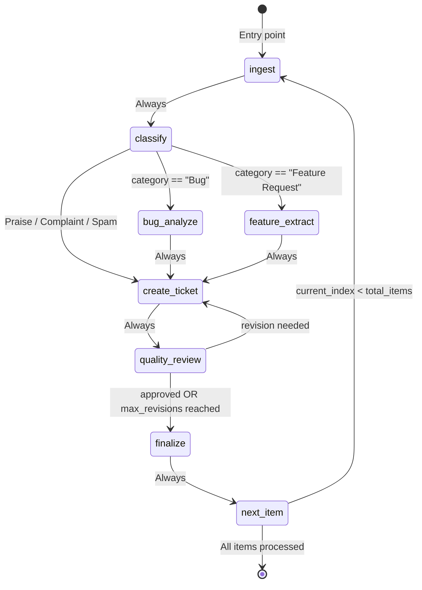
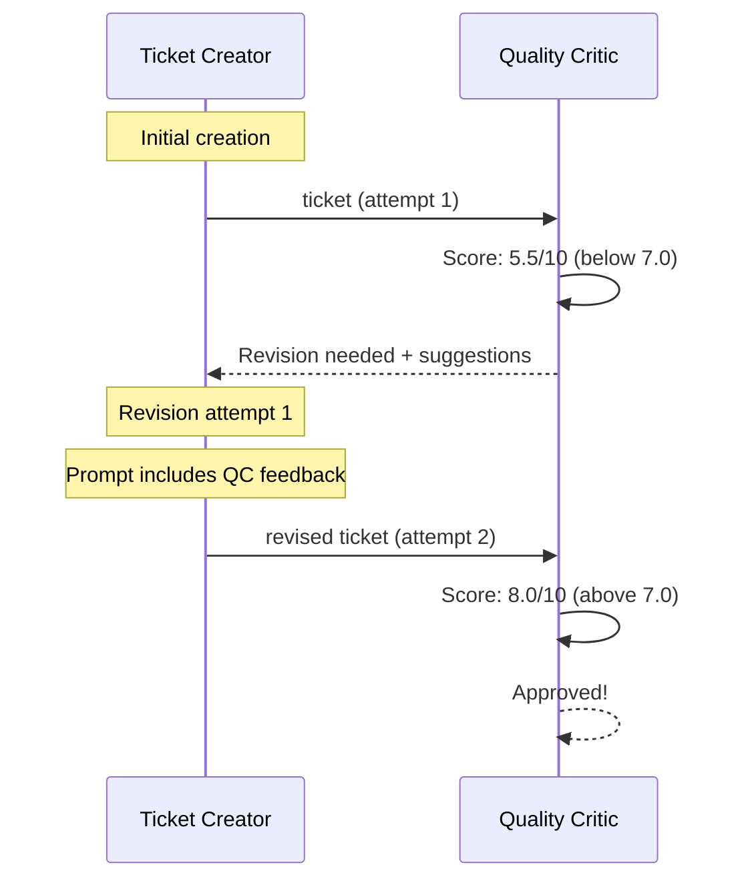

# LangGraph Pipeline

## Overview

The feedback processing pipeline is built as a **LangGraph StateGraph** that processes a batch of feedback items sequentially. Each item flows through classification, optional analysis (bug or feature), ticket creation, and quality review — with a revision loop for tickets that don't meet quality standards.

All pipeline code is in `src/graph/workflow.py`. State definitions are in `src/models/state.py`.

---

## PipelineState TypedDict

### FeedbackItemState (`state.py:7-18`)

Represents a single feedback item flowing through the pipeline:

```python
class FeedbackItemState(TypedDict):
    feedback_id: int       # raw_feedback.id
    source_id: str         # External ID (review_id, email_id, MANUAL-xxx)
    source_type: str       # app_store_review | support_email | manual_input
    content_text: str      # The feedback text body
    subject: Optional[str]
    rating: Optional[int]  # 1-5 stars
    platform: Optional[str]
    app_version: Optional[str]
    raw_json: str
```

### PipelineState (`state.py:21-53`)

Top-level state shared across all nodes:

| Field | Type | Purpose |
|-------|------|---------|
| **Batch-level** | | |
| `batch_id` | `str` | Unique batch identifier (UUID[:8]) |
| `trace_id` | `str` | Langfuse trace correlation ID (full UUID) |
| `feedback_items` | `list[FeedbackItemState]` | All items to process |
| `current_index` | `int` | Index of current item being processed |
| `total_items` | `int` | Total items in the batch |
| **Current item** | | |
| `current_item` | `Optional[FeedbackItemState]` | The item currently being processed |
| **Processing outputs** | | |
| `classification` | `Optional[dict]` | `{category, confidence, reasoning}` |
| `analysis` | `Optional[dict]` | `{technical_details, feature_details, suggested_title, ...}` |
| `ticket` | `Optional[dict]` | `{ticket_id, feedback_id, category, title, description, priority}` |
| `quality_review` | `Optional[dict]` | `{score, breakdown, approved, notes, revision_suggestions}` |
| **Control flow** | | |
| `current_agent` | `str` | Name of active agent (for UI status updates) |
| `status` | `str` | `ingesting` \| `classifying` \| `analyzing` \| `ticketing` \| `reviewing` \| `done` \| `error` |
| `error_message` | `Optional[str]` | Error details if processing fails |
| `revision_count` | `int` | Number of revision attempts for current item |
| **Accumulator** | | |
| `completed_tickets` | `Annotated[list[str], operator.add]` | Ticket IDs of all completed items |

The `completed_tickets` field uses `Annotated[list[str], operator.add]` (`state.py:53`) — this tells LangGraph to **merge lists additively** when a node returns `{"completed_tickets": [ticket_id]}` rather than replacing the existing list. This is essential for tracking all tickets across the batch loop.

---

## Pipeline Nodes

| Node | Function | File:Line | LLM? | State Changes |
|------|----------|-----------|------|---------------|
| `ingest` | `ingest_node` | `csv_agent.py:68` | No | Sets `current_item`, resets classification/analysis/ticket/review to `None` |
| `classify` | closure from `create_classify_node(llm)` | `classifier.py:60` | Yes | Sets `classification` |
| `bug_analyze` | closure from `create_bug_analyze_node(llm)` | `bug_analyzer.py:42` | Yes | Sets `analysis` (with `technical_details`) |
| `feature_extract` | closure from `create_feature_extract_node(llm)` | `feature_extractor.py:41` | Yes | Sets `analysis` (with `feature_details`) |
| `create_ticket` | closure from `create_ticket_node(llm, use_mcp)` | `ticket_creator.py:85` | Yes | Sets `ticket`, stores in DB/MCP |
| `quality_review` | closure from `create_quality_review_node(llm)` | `quality_critic.py:47` | Yes | Sets `quality_review`, increments `revision_count` if not approved |
| `finalize` | `finalize_node` | `workflow.py:58` | No | Appends `ticket_id` to `completed_tickets` |
| `next_item` | `next_item_node` | `workflow.py:71` | No | Increments `current_index` |

---

## Routing Functions

### `route_after_classification(state)` (`workflow.py:27-36`)

Routes based on the classification category:

```python
def route_after_classification(state: PipelineState) -> str:
    category = state["classification"]["category"]
    if category == "Bug":
        return "bug_analyze"
    elif category == "Feature Request":
        return "feature_extract"
    else:  # Praise, Complaint, Spam
        return "create_ticket"
```

Bug and Feature Request items receive specialized analysis. Other categories (Praise, Complaint, Spam) skip analysis and go directly to ticket creation.

### `route_after_review(state)` (`workflow.py:39-44`)

Routes based on the quality review result:

```python
def route_after_review(state: PipelineState) -> str:
    review = state["quality_review"]
    if review["approved"] or state["revision_count"] >= settings.max_revision_count:
        return "finalize"
    return "create_ticket"
```

A ticket is finalized if:
1. The quality score meets the auto-approve threshold (default 7.0), **OR**
2. The maximum revision count (default 2) has been reached

Otherwise, it loops back to the Ticket Creator for revision.

### `route_next_or_end(state)` (`workflow.py:47-51`)

Controls the batch loop:

```python
def route_next_or_end(state: PipelineState) -> str:
    if state["current_index"] < state["total_items"]:
        return "ingest"
    return "end"
```

---

## Pipeline Flow Diagram



---

## Batch Processing Loop

The pipeline processes multiple feedback items sequentially using a loop pattern:

```
Batch: [Item 0, Item 1, Item 2, ...]

Iteration 1: current_index=0 → ingest → classify → ... → finalize → next_item (index→1)
Iteration 2: current_index=1 → ingest → classify → ... → finalize → next_item (index→2)
Iteration 3: current_index=2 → ingest → classify → ... → finalize → next_item (index→3)
...
Final:       current_index=N → next_item → END
```

Key mechanics:
- `ingest_node` picks `feedback_items[current_index]` and resets all intermediate state (`csv_agent.py:86-95`)
- `finalize_node` appends `ticket_id` to the `completed_tickets` accumulator (`workflow.py:64-65`)
- `next_item_node` increments `current_index` by 1 (`workflow.py:73`)
- `route_next_or_end` checks if more items remain (`workflow.py:49`)

---

## `build_pipeline()` Function (`workflow.py:86-194`)

### Parameters

```python
def build_pipeline(
    api_key: Optional[str] = None,       # OpenAI API key (defaults to settings)
    model: Optional[str] = None,         # Model name (defaults to settings.openai_model)
    temperature: Optional[float] = None, # LLM temperature (defaults to settings.openai_temperature)
    use_mcp: bool = False,               # Create tickets via MCP instead of direct DB
    status_callback: Optional[Callable] = None,  # Real-time UI status updates
) -> StateGraph
```

### LLM Configuration (`workflow.py:105-109`)

Creates a single `ChatOpenAI` instance shared by all agents:

```python
llm = ChatOpenAI(
    api_key=api_key or settings.openai_api_key,
    model=model or settings.openai_model,
    temperature=temperature if temperature is not None else settings.openai_temperature,
)
```

### Status Callback Mechanism (`workflow.py:118-129`)

If a `status_callback` is provided, each node is wrapped with `_with_callback()`:

```python
if status_callback:
    classify = _with_callback(classify, status_callback)
    bug_analyze = _with_callback(bug_analyze, status_callback)
    # ... all nodes wrapped
```

### Graph Construction (`workflow.py:131-185`)

```python
workflow = StateGraph(PipelineState)

# 8 nodes
workflow.add_node("ingest", _ingest)
workflow.add_node("classify", classify)
workflow.add_node("bug_analyze", bug_analyze)
workflow.add_node("feature_extract", feature_extract)
workflow.add_node("create_ticket", create_ticket)
workflow.add_node("quality_review", quality_review)
workflow.add_node("finalize", _finalize)
workflow.add_node("next_item", next_item_node)

# Entry point
workflow.set_entry_point("ingest")

# Fixed edges
workflow.add_edge("ingest", "classify")
workflow.add_edge("bug_analyze", "create_ticket")
workflow.add_edge("feature_extract", "create_ticket")
workflow.add_edge("create_ticket", "quality_review")
workflow.add_edge("finalize", "next_item")

# Conditional edges
workflow.add_conditional_edges("classify", route_after_classification, {...})
workflow.add_conditional_edges("quality_review", route_after_review, {...})
workflow.add_conditional_edges("next_item", route_next_or_end, {...})
```

### Langfuse Integration (`workflow.py:187-192`)

After compilation, the pipeline attaches a Langfuse callback handler if available:

```python
compiled = workflow.compile()
langfuse_handler = create_langfuse_handler()
if langfuse_handler:
    compiled = compiled.with_config({"callbacks": [langfuse_handler]})
```

This automatically traces all LLM invocations through LangChain's callback system.

---

## `create_initial_state()` Helper (`workflow.py:197-219`)

Creates the initial `PipelineState` for a batch:

```python
def create_initial_state(
    feedback_items: list[dict],
    batch_id: Optional[str] = None,
    trace_id: Optional[str] = None,
) -> PipelineState
```

Initializes all fields:
- `batch_id`: provided or random `UUID[:8]`
- `trace_id`: provided or random full UUID
- `current_index`: `0`
- `total_items`: `len(feedback_items)`
- All processing fields: `None`
- `revision_count`: `0`
- `completed_tickets`: `[]`

---

## `_with_callback()` Wrapper (`workflow.py:222-241`)

Wraps a node function to call the status callback after execution:

```python
def _with_callback(node_fn, callback):
    def wrapped(state):
        result = node_fn(state)
        callback({
            "agent": result.get("current_agent", ""),
            "status": result.get("status", ""),
            "current_index": state.get("current_index", 0),
            "total_items": state.get("total_items", 0),
            "ticket": result.get("ticket"),
            "classification": result.get("classification") or state.get("classification"),
            "quality_review": result.get("quality_review"),
        })
        return result
    return wrapped
```

Callback errors are caught and logged but don't block pipeline execution (`workflow.py:237-238`).

---

## Revision Loop Detail

When a ticket doesn't meet the quality threshold, a revision loop occurs:



The Ticket Creator includes the critic's feedback in its prompt for revision attempts (`ticket_creator.py:72-81`):
- Quality score
- Quality notes
- Specific revision suggestions

If `max_revision_count` (default 2) is reached without approval, the ticket is force-finalized regardless of score (`workflow.py:42`).

---

## Related Documentation

- [Agent Design](agent_design.md) — Individual agent details
- [Database Schema](database_schema.md) — How tickets/feedback are stored
- [Observability](observability.md) — Langfuse callback mechanism
