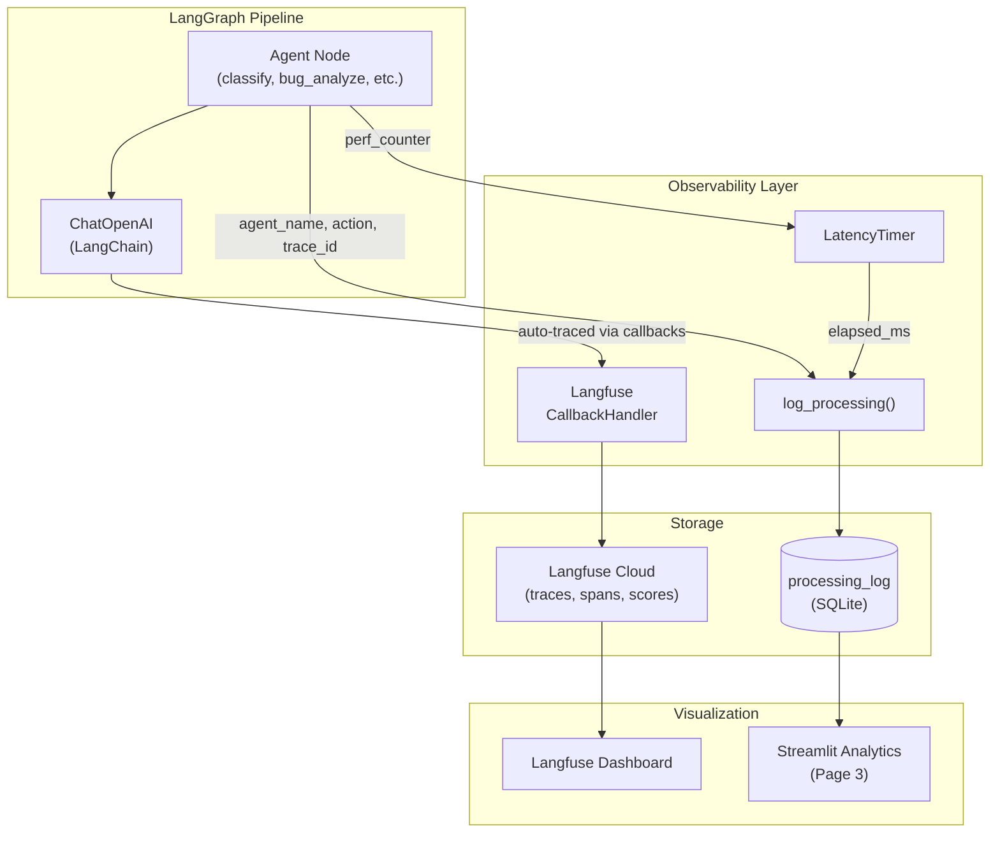

# Observability

## Overview

The system uses **Langfuse** for LLM tracing and a custom **metrics collector** for batch-level analytics. Tracing is designed with graceful degradation — all tracing functions return `None` if Langfuse is not configured, so the pipeline runs normally without observability keys set.

Tracing code is in `src/observability/tracing.py`. Metrics code is in `src/observability/metrics.py`.

---

## Langfuse Integration (`tracing.py`)

### `get_langfuse()` (`tracing.py:15-31`)

Lazy-initialized singleton Langfuse client:

```python
_langfuse_client = None

def get_langfuse():
    global _langfuse_client
    if _langfuse_client is None:
        _langfuse_client = Langfuse(
            public_key=settings.langfuse_public_key,
            secret_key=settings.langfuse_secret_key,
            host=settings.langfuse_host,
        )
    return _langfuse_client
```

- Creates the client on first call, reuses on subsequent calls
- Returns `None` on initialization failure (e.g., missing keys) — tracing is disabled gracefully (`tracing.py:28-30`)
- Configuration comes from `.env` via `settings` (`config.py:13-15`)

### `create_langfuse_handler()` (`tracing.py:34-64`)

Creates a **LangChain CallbackHandler** for automatic tracing of all LLM operations:

```python
def create_langfuse_handler(
    trace_id: Optional[str] = None,
    session_id: Optional[str] = None,
    user_id: Optional[str] = None,
) -> CallbackHandler | None
```

- Returns a `langfuse.langchain.CallbackHandler` configured with the Langfuse credentials
- Accepts optional `trace_id`, `session_id`, `user_id` for trace correlation
- Returns `None` on failure

This is the primary integration point — when attached to the LangGraph pipeline, it automatically traces every LLM invocation, capturing prompts, responses, token usage, and latency.

### `create_trace()` (`tracing.py:67-89`)

Creates a root trace in Langfuse:

```python
def create_trace(
    name: str,
    session_id: Optional[str] = None,
    user_id: Optional[str] = None,
    input_data: Optional[dict] = None,
    metadata: Optional[dict] = None,
) -> trace | None
```

- Creates a named trace via `langfuse.trace()`
- Returns the trace object for attaching spans and scores, or `None`

### `traced_span()` (`tracing.py:92-124`)

Context manager for creating **timed spans** within a trace:

```python
@contextmanager
def traced_span(trace, name: str, input_data: Optional[dict] = None):
    """
    Usage:
        with traced_span(trace, "csv_agent", {"file": "reviews.csv"}) as span:
            # do work
            span.update(output={"items_parsed": 25})
    """
```

- Creates a span via `trace.span(name, input)` (`tracing.py:110`)
- Automatically captures `latency_ms` in metadata on exit (`tracing.py:120-124`)
- On exception: updates span with error output and `level="ERROR"` (`tracing.py:113-117`)
- If `trace` is `None` (tracing disabled): yields `None` and does nothing (`tracing.py:101-103`)

### `score_trace()` (`tracing.py:127-139`)

Attaches a numeric score to a trace:

```python
def score_trace(trace, name: str, value: float, comment: Optional[str] = None) -> None
```

- Calls `trace.score(name, value, comment)` (`tracing.py:137`)
- Use cases: attach classification confidence scores, quality review scores
- Silently fails if trace is `None` or on error

### `flush()` (`tracing.py:142-149`)

Flushes any pending Langfuse events:

```python
def flush() -> None:
    langfuse = get_langfuse()
    if langfuse:
        langfuse.flush()
```

---

## Where Tracing Hooks In

### Pipeline Level (`workflow.py:187-192`)

The `build_pipeline()` function attaches the Langfuse handler to the compiled graph:

```python
compiled = workflow.compile()
langfuse_handler = create_langfuse_handler()
if langfuse_handler:
    compiled = compiled.with_config({"callbacks": [langfuse_handler]})
```

This single integration point captures **all LLM calls** made by any agent in the pipeline through LangChain's callback system. Each call is recorded in Langfuse with:
- Input messages (system + human prompts)
- LLM response content
- Token usage (input/output/total)
- Latency
- Model name and parameters

### Agent Level

Each agent logs a `trace_id` to the `processing_log` table for correlation:

| Agent | File:Line |
|-------|-----------|
| Classifier | `classifier.py:102` |
| Bug Analyzer | `bug_analyzer.py:97` |
| Feature Extractor | `feature_extractor.py:93` |
| Ticket Creator | `ticket_creator.py:182` |
| Quality Critic | `quality_critic.py:118` |
| CSV Agent | `csv_agent.py:62` (no trace_id, uses conn) |

Pattern used by all agents:
```python
log_processing(
    agent_name="classifier",
    action="classify",
    status="success",
    feedback_id=item["feedback_id"],
    latency_ms=timer.elapsed_ms,
    trace_id=state.get("trace_id"),  # Langfuse correlation
)
```

---

## Metrics (`metrics.py`)

### `ProcessingMetric` Dataclass (`metrics.py:8-18`)

```python
@dataclass
class ProcessingMetric:
    feedback_id: int
    agent_name: str
    latency_ms: float
    category: str = ""
    status: str = "success"
    error: Optional[str] = None
    quality_score: float = 0.0
```

A single metric record from one agent processing one feedback item.

### `MetricsCollector` (`metrics.py:21-85`)

Collects and aggregates metrics for an entire batch:

```python
collector = MetricsCollector(batch_id="abc123")
collector.record(ProcessingMetric(...))
summary = collector.get_summary()
```

**`get_summary()`** (`metrics.py:32-85`) returns:

```python
{
    "batch_id": "abc123",
    "total_items": 10,
    "total_duration_ms": 45000.0,
    "by_agent": {
        "classifier": {"count": 10, "avg_ms": 1200.0, "max_ms": 1800.0, "min_ms": 900.0},
        "bug_analyzer": {"count": 4, "avg_ms": 1500.0, ...},
        # ...
    },
    "by_category": {
        "Bug": 4,
        "Feature Request": 3,
        "Praise": 2,
        "Complaint": 1,
    },
    "error_count": 0,
    "avg_quality_score": 8.2,
}
```

- **by_agent:** groups by agent name, calculates count/avg/max/min latency
- **by_category:** counts from classifier records only (`metrics.py:60-61`)
- **avg_quality_score:** averages from quality_critic records with score > 0 (`metrics.py:67-74`)

### `LatencyTimer` (`metrics.py:88-101`)

Simple context manager for measuring elapsed time:

```python
class LatencyTimer:
    def __enter__(self):
        self.start_time = time.perf_counter()
        return self

    def __exit__(self, *args):
        self.elapsed_ms = (time.perf_counter() - self.start_time) * 1000
```

Used by every LLM agent:
```python
with LatencyTimer() as timer:
    response = llm.invoke([...])
# timer.elapsed_ms contains the duration
```

---

## Observability Architecture



---

## Langfuse Dashboard Usage

### Viewing Traces

When Langfuse keys are configured, you can view traces at your Langfuse host (default: `https://cloud.langfuse.com`). Each pipeline invocation creates a trace containing:

- All LLM calls as **generations** (with full prompt/response)
- Token usage per call and total
- Latency breakdown per agent
- Any custom spans added via `traced_span()`
- Scores attached via `score_trace()`

### Interpreting Spans

Spans represent timed operations within a trace. The `traced_span()` context manager adds:
- `input`: the data passed to the operation
- `output`: the result (or error)
- `metadata.latency_ms`: elapsed time in milliseconds
- `level`: `DEFAULT` for success, `ERROR` for exceptions

### Scores

Scores are numeric values attached to traces for evaluation:
- **Classification confidence:** 0.0-1.0 — how confident the classifier was
- **Quality score:** 0.0-10.0 — the Quality Critic's assessment

These can be used in Langfuse to build evaluation dashboards and track quality over time.

---

## Related Documentation

- [Agent Design](agent_design.md) — How each agent uses LatencyTimer and logging
- [LangGraph Pipeline](langgraph_pipeline.md) — How the Langfuse handler is attached
- [Streamlit UI](streamlit_ui.md#page-3-analytics) — How metrics are visualized
- [Database Schema](database_schema.md#table-processing_log) — The processing_log table
