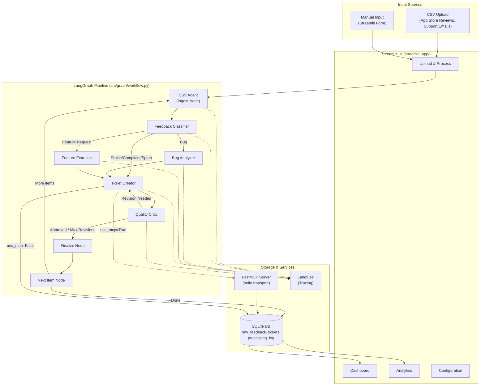

# Project Overview

## Business Problem

Manually triaging user feedback from app store reviews and support emails is time-consuming, inconsistent, and error-prone. Product and engineering teams need feedback categorized, analyzed, and turned into actionable tickets — but doing this by hand at scale creates bottlenecks and missed insights.

The **Intelligent User Feedback Analysis System** automates this entire pipeline: ingesting raw feedback, classifying it into categories (Bug, Feature Request, Praise, Complaint, Spam), performing deep analysis, generating structured tickets, and quality-reviewing the output — all powered by a 6-agent AI architecture.

## Solution: 6-Agent AI Pipeline

The system uses six specialized AI agents orchestrated by a LangGraph StateGraph to process feedback end-to-end:

| # | Agent | Role | LLM? |
|---|-------|------|------|
| 1 | **CSV Agent** | Parses CSV files, stores raw feedback in SQLite | No |
| 2 | **Feedback Classifier** | Classifies feedback into 5 categories with confidence | Yes |
| 3 | **Bug Analyzer** | Extracts severity, affected component, reproduction steps | Yes |
| 4 | **Feature Extractor** | Identifies feature name, user impact, demand signal | Yes |
| 5 | **Ticket Creator** | Generates structured tickets (direct DB or via MCP) | Yes |
| 6 | **Quality Critic** | Reviews tickets on 5 criteria, scores 0-10, approves or requests revision | Yes |

Each LLM-based agent uses a factory pattern (`create_*_node(llm)`) that returns a closure capturing a shared `ChatOpenAI` instance (`src/graph/workflow.py:111-116`). This ensures all agents share the same LLM configuration while remaining independently testable.

## Architecture Diagram



## Tech Stack

| Component | Technology | Version | Purpose |
|-----------|-----------|---------|---------|
| Language | Python | >= 3.12 | Core runtime (`pyproject.toml:9`) |
| LLM Orchestration | LangGraph | >= 1.0.0 | StateGraph pipeline, conditional routing |
| LLM Framework | LangChain + LangChain-OpenAI | >= 0.3.0 | Agent message handling, LLM invocation |
| LLM Provider | OpenAI GPT-5.4 | — | All 5 LLM-based agents (`src/config.py:9`) |
| MCP Server | FastMCP | >= 2.0.0 | Tool-based ticket creation over stdio |
| Database | SQLite (WAL mode) | Built-in | Feedback, tickets, processing log storage |
| Web UI | Streamlit | >= 1.38.0 | 4-page interactive dashboard |
| Observability | Langfuse | >= 3.14.0 | LLM tracing, scoring, spans |
| Data Validation | Pydantic + Pydantic-Settings | >= 2.0.0 | Schema models, environment config |
| Charts | Plotly | >= 5.0.0 | Analytics visualizations |
| Environment | python-dotenv | >= 1.0.0 | `.env` file loading |

## Key Design Decisions

1. **Agent factory pattern** — Each LLM agent is created via `create_*_node(llm)` which returns a closure. A single `ChatOpenAI` instance is created in `build_pipeline()` (`workflow.py:105-109`) and passed to all factories, ensuring consistent model configuration.

2. **Additive accumulator for completed tickets** — `completed_tickets` uses `Annotated[list[str], operator.add]` (`state.py:53`), which tells LangGraph to merge returned lists additively rather than replacing — essential for tracking all tickets across the batch loop.

3. **Dual ticket creation path** — Tickets can be created via direct DB insert (`insert_ticket()`) or via the MCP server (`_create_via_mcp()`), controlled by the `use_mcp` flag (`ticket_creator.py:134-160`). This demonstrates MCP integration while keeping a simple default path.

4. **Quality feedback loop** — The Quality Critic can send tickets back to the Ticket Creator for revision, up to `max_revision_count` (default 2, `config.py:25`). The Ticket Creator includes the critic's feedback in its prompt for revision attempts (`ticket_creator.py:72-81`).

5. **Graceful degradation** — All agents fall back to sensible defaults on JSON parse errors. Langfuse tracing degrades gracefully when keys aren't configured (all functions return `None`).

## Project Structure

```
User_Feedback_AI_system/
├── streamlit_app/
│   ├── app.py                         # Main entry point + home page
│   └── pages/
│       ├── 1_Upload_and_Process.py    # CSV upload, manual input, real-time processing
│       ├── 2_Dashboard.py             # Ticket table, detail view, manual override
│       ├── 3_Analytics.py             # Charts, classification accuracy
│       └── 4_Configuration.py         # API keys, thresholds, connection tests
├── src/
│   ├── config.py                      # Pydantic settings from .env
│   ├── agents/
│   │   ├── csv_agent.py               # CSV ingestion + ingest node
│   │   ├── classifier.py              # 5-category classification
│   │   ├── bug_analyzer.py            # Bug severity/component extraction
│   │   ├── feature_extractor.py       # Feature impact/demand analysis
│   │   ├── ticket_creator.py          # Structured ticket generation (DB/MCP)
│   │   └── quality_critic.py          # 5-criteria quality review
│   ├── graph/
│   │   └── workflow.py                # LangGraph StateGraph definition
│   ├── models/
│   │   ├── schemas.py                 # Pydantic data models
│   │   └── state.py                   # PipelineState + FeedbackItemState TypedDicts
│   ├── db/
│   │   ├── database.py                # SQLite init, connection management
│   │   └── queries.py                 # 11 query helper functions
│   ├── mcp_server/
│   │   └── server.py                  # FastMCP server (3 tools)
│   ├── observability/
│   │   ├── tracing.py                 # Langfuse integration
│   │   └── metrics.py                 # ProcessingMetric, MetricsCollector, LatencyTimer
│   └── utils/
│       └── csv_parser.py              # CSV parsing + type detection
├── tests/                             # 9 test modules
├── data/
│   ├── mock/                          # Sample CSVs + expected classifications
│   └── db/                            # SQLite database files
├── .env.example                       # Environment variable template
├── pyproject.toml                     # Project metadata + dependencies
└── requirements.txt                   # Pip dependencies
```

## Related Documentation

- [Agent Design](agent_design.md) — Detailed documentation of each agent
- [LangGraph Pipeline](langgraph_pipeline.md) — Pipeline state, nodes, and routing
- [Database Schema](database_schema.md) — SQLite tables and query helpers
- [MCP Server](mcp_server.md) — FastMCP ticket management tools
- [Streamlit UI](streamlit_ui.md) — 4-page user interface
- [Observability](observability.md) — Langfuse tracing and metrics
- [Setup and Usage](setup_and_usage.md) — Installation and running guide
